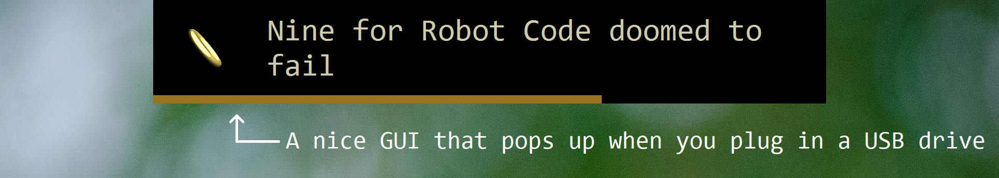

OneLog
======

> *Three Logs for the Camera streams of the Raspis,*                \
> &nbsp; *Seven for the Dashboards in their weird folders,*         \
> *Nine for Robot Code doomed to fail,*                             \
> &nbsp; *One for the Coder on the laptop*                          \
> *In the USB Drive where the Files lie.*                           \
> &nbsp; *One Log to rule them all, One Log to find them,*          \
> &nbsp; *One Log to bring them all and in some code combine them*  \
> *In the USB Drive where the Files lie*.

## What is this besides a bad appropriation of some Tolkein lines?

OneLog is a tool for automatically transferring log files, whether they be stored locally or on multiple devices or procedurally generated on the fly, to usb drives.

It runs in the background, listening for usb-drive-plugging-in events, then downloads all your logs onto the drive when it receives such an event.



OneLog is written for FRC, where time with your pretty robot is crucial and trying to download logs while there are people both repairing the robot and changing its code can be pretty hectic / impossible.

## Config

OneLog operates based off a config file named `logs.toml`. As the name indicates, it's written in [TOML](https://github.com/toml-lang/toml).

It is required that each table name start with a number (for example "three" or "seven"). This determines the sort order of these tables, as well as allowing for the special case of One.

In the config there should be only one table starting with "One", which specifies general application options.
Its keys are as follows:

```toml
["One for the Coder on the laptop"] # Notice the "One" here
volume = "UsbDrive"                 # The volume name of the USB Drive to exclusively transfer logs to
dir = "logs"                        # The directory on the USB Drive to write logs to
time_format = "yyyy-MM-dd HH;mm;ss" # [Format][df] for creating sub
app_log = "app.log"                 # The name of a log file to store application events
combined_log =  "combined.log"      # The name of a log file to store a combined version of all logs
```

All other tables describe logs that are to be ruled, found, brought, and combined. Each of these consists to two mandatory keys:

```toml
type = "Local" # Refers to a class under the onelog.downloader package responsible for downloading the logs
parser = "Bunyan" # Refers to a parser under the onelog.parser package to parse arbitrary log formats
                  # so the combined log is one format
```

The `type` field determines any additional options that need to be specified under the table. The options map to instance variables within the downloader class, so generally you'll need a key for each of these instance variables.

## Built-in downloaders

OneLog comes with a few built-in downloaders for retrieving files both locally and from remote devices. If you need to implement your own, all downloaders extend the abstract class `onelog.downloader.Downloader`.

### `onelog.downloader.Local`

The local downloader files move file from the computer running OneLog to the usb drive. It takes in a single key `files`, which is array of paths or glob expressions locating the files to download.

Some examples follow. They assume the directory structure is as follows:
```
/
└── a
    └── foo
        ├── bar
        ├── bar-bar
        └── bartender
            ├── foobar
            └── food
```

The following lines would download the files specified in the comments, where `$ROOT` is the relevant subfolder within the logs directory:

```toml
files = [
     # Downloads /a/foo/bar as $ROOT/bar
    "/a/foo/bar",

    # Downloads /a/foo/bar as $ROOT/bar, /a/foo/bar-bar as $ROOT/bar-bar
    "/a/foo//bar*",

    # Downloads /a/foo/bar as $ROOT/foo/bar, /a/foo/bar-bar as $ROOT/foo/bar-bar
    "/a//foo/bar*",

    # Downloads /a/foo/bar as $ROOT/bar, /a/foo/bar-bar as $ROOT/bar-bar,
    # /a/foo/bartender/foobar as $ROOT/bartender/foobar, /a/foo/bartender/food as $ROOT/bartender/food
    "/a/foo//bar**",

    # Downloads /a/foo/bartender/foobar as $ROOT/foobar, /a/foo/bartender/food as $ROOT/food
    "/a/foo/bartender//*//2",

    # Downloads /a/foo/bartender/food as $ROOT/food
    "/a/foo/bartender//*//1"
]
```

In general, these filepaths can either be normal ones to single files, or ones separated by double slashes of the form `a//b//c`, where `a` points to a directory whose structure will not be copied and contains no glob expressions, `b` points to directories and files whose structure will be copied (and may contain glob expression), and `c` optionally specifies the number of files that will be downloaded.

`c` is useful in cases where you have a directory with many files with timestamps in their name. Because the files will be sorted in alphabetical order before grabbing the last few, specifying `c` allows you to only download the most recent logs.

### `onelog.downloader.Sftp`

Compared to the local file downloader, the sftp downloader is less featureful. Currently, it does not support glob expressions and only allows for absolute paths.

It requires the following options:

```toml
host = "myhost" # The hostname or ip address of the device
port = 22       # The port hosting the ssh server
username="user" # The username to log into
password="pass" # Password to use to log in
files = [       # The files to download
    "/i/don't/know"
]
```
## Built-in parsers

Parsers are integral to combining logs into a single, uniform format. OneLog includes a variety of built-in parsers:

### `onelog.parser.Bunyan`

Parses logs in [Bunyan's](https://www.npmjs.com/package/bunyan) JSON format. These logs can either come from the node module, or you can generate them using your own log formatter (OneLog includes one as `onelog.BunyanLogger`). The format is quite nice as Bunyan's includes a command-line tool for viewing logs at various verbosities in colored form.

### `onelog.parser.None`

A parser that does no parsing. In other words, logs parsed using this parser won't be combined into the One Log.

### `onelog.parser.Python`

This parser is for parsing logs generated by Python's `logging` library in the format `"%(asctime)s - %(name)s - %(levelname)s - %(message)s"`.

## Architecture and compiling from source

OneLog is written in both C++ (for accessing the Windows API) and Java (for everything else). Thus, code lies in two different directories: `jni` for C++ and `src` for Java. The `jni` folder contains a Visual Studio solution, so if desired you can edit that code in Visual Studio and the Java code in something else.

`gradlew run` will do all the work of compiling both sets of source code as well as running the thing.

## Does this run on [Puppy Linux](http://puppylinux.com/)?

Unfortunately, no. The code to detect USB drives being plugged in uses Windows APIs, so it only works on Windows (however everything else works cross-platform if that matters).

[df]: https://docs.oracle.com/javase/9/docs/api/java/text/SimpleDateFormat.html
